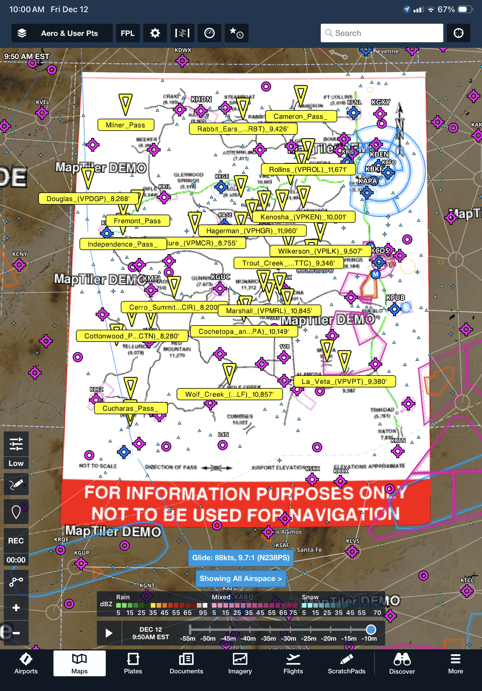
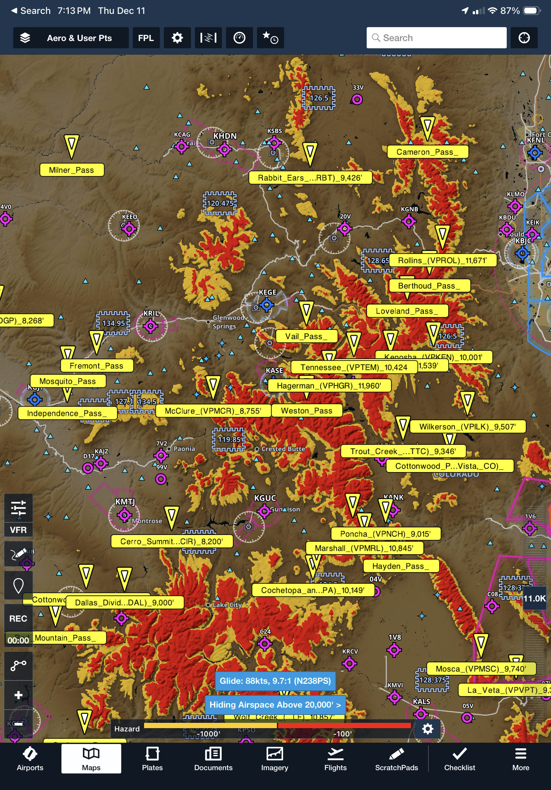

# Colorado Mountain Flying Content Pack for ForeFlight

**Download:** [Colorado_Mountain_Passes_Pack.zip](https://github.com/ingramleedy/ForeFlightContentPacks/blob/main/Colorado_Mountain_Passes/Colorado_Mountain_Passes_Pack.zip?raw=true)

This repository provides a **ForeFlight content pack** containing custom VFR GPS waypoints and a map layer for key mountain passes in Colorado. These waypoints and overlays help pilots safely navigate the challenging Rocky Mountain terrain by providing clear crossing points, recommended altitude margins, and enhanced situational awareness.

The content pack displays passes as a custom map layer in ForeFlight, integrating seamlessly with terrain, hazard advisor, profile view, and sectional charts for better route planning.

   
  
 

  
  

## Content Overview

This content pack includes VFR waypoints for numerous Colorado mountain passes, drawn from the **Colorado Pilots Association (CPA)** comprehensive training materials and expanded to cover commonly flown routes. It includes both official CDOT/FAA-charted waypoints (added to sectionals in 2024 and available natively in ForeFlight) and additional user waypoints for passes frequently referenced in mountain flying education.

**Current version: 2025.12.11**  
**Number of passes: 36**

Many official waypoints (e.g., for 10-20 key passes) are now integrated directly into ForeFlight via FAA updates. This custom pack supplements those with additional passes, detailed notes, and a dedicated overlay layer for quick reference.

### Enhanced Usage with ForeFlight Hazard Advisor

For optimal safety in mountain flying, use this content pack in conjunction with ForeFlight's **Hazard Advisor** feature. Hazard Advisor overlays color-coded terrain and obstacle alerts (red for within 100' of your altitude, yellow for within 1,000') on the map, helping you visualize clearance margins when planning routes over these passes. It also integrates with Profile View for a vertical cross-section of hazards along your flight path.

- **Activation:** Enable Hazard Advisor in Map Settings > Layers > Hazard Advisor. Set your Hazard Altitude to match your planned crossing altitude (e.g., 1,000–2,000' above pass elevation).
- **In-Flight Mode:** When airborne and GPS speed exceeds the activation threshold (default 60 kts), it auto-adjusts to your current altitude for real-time alerts.
- **Subscription Note:** Hazard Advisor requires a ForeFlight **Essential** subscription or higher. For advanced options like custom hazard altitudes, consider Pro Plus or Performance plans.

This combination allows you to cross-reference pass waypoints with dynamic hazard shading, ensuring you maintain safe margins in variable winds and terrain.

## Inspiration and Credits

This content pack is inspired by and draws heavily from authoritative Colorado mountain flying resources:

- **[Colorado Pilots Association (CPA)](https://coloradopilots.org/)** – Primary source for mountain flying education, courses, and pass guidance.
- **[CPA Mountain Passes Reference](https://coloradopilots.org/content.aspx?page_id=22&club_id=612720&module_id=319187)** – Detailed descriptions of routes, elevations, weather visibility, turbulence notes, and safety considerations for dozens of passes.
- **[Matt Beyer's Mountain Flying Guide](http://www.mattbeyer.com/files/Matts-MountainFlying.pdf)** (from [Matt Beyer Training](https://www.mattbeyer.com/training/#mountainflying)) – Comprehensive PDF on techniques, example routes, weather interpretation, performance, up/downdraft handling, and safety.
- **[GeezerGeek Coach Mountain Flying Reference Materials](https://docs.google.com/document/d/1chfDa3JBCjsGykGjwrAFwOqMAS7d3_dIY9ieROLCIyU/edit?tab=t.0#heading=h.a3dtnd8wn55p)** – Additional practical tips emphasizing preparedness, emergency planning, and high-altitude operations.
- **Mountain Flying Tips.pdf** – Local pilot compilation of essential advice on density altitude, leaning mixtures, off-airport landings, and other high-altitude considerations.
- **[CDOT Aeronautics Program](https://www.codot.gov/programs/aeronautics)** – Official source for many VFR waypoints, including the 2025 Colorado Airport Directory; request updated materials via [CDOT Request Form](https://www.codot.gov/programs/aeronautics/request-form).

## Included Mountain Passes

The pack includes the following passes, with official waypoint codes where available (VPxxx series from CDOT/FAA), elevations, and brief notes/routes derived from CPA, CDOT, and other references:

| Pass Name                  | Waypoint | Elevation     | Notes / Common Route |
|----------------------------|----------|---------------|----------------------|
| Berthoud Pass             |          | 11,315' MSL  | Route: Denver west to Granby/Kremmling (central mountains). This pass follows I-70 to Highway 40 west from Denver. Expect strong downdrafts and limited climb capability when moderate to high winds aloft exist. East to west flight path will be a blind right turn to cross the pass. Mines Peak AWOS 134.325 (0CO). |
| Cameron Pass              |          | 10,276' MSL  | Route: Fort Collins west to northern mountains (Walden). This pass is not visible to any weather reporting stations. |
| Cerro Summit              | VPCIR   | 8,200' MSL   | Located about 14 miles east of Montrose, Colorado. |
| Cochetopa Pass            | VPOPA   | 10,067' MSL  | Route: Located between San Luis Valley and Gunnison area in the center of the state. The vicinity of these adjacent passes is partially visible from Alamosa and Gunnison weather reporting stations. Elevations and weather often favor these passes over Monarch Pass. (Combined with North Pass in some references.) |
| Cottonwood Pass (Near Buena Vista, CO) |    | 12,126' MSL  | Route: Buena Vista to Taylor Park/Gunnison Area. This pass is a better alternative than Monarch Pass in moderate winds aloft. Bald Mountain AWOS 132.05 (7BM). |
| Cottonwood Pass (Near Eagle, CO) | VPCTN |         | An alternative to following the river over Glenwood Canyon with better options for emergency landing sites. |
| Cucharas Pass             |          | 9,941' MSL   | Route: Southeastern plains (Trinidad) to San Luis Valley and Alamosa. This pass is located west of the Spanish Peaks and leads to La Veta Pass for crossing into the San Luis Valley. |
| Cumbres Pass              |          | 10,022' MSL  | Route: Alamosa to Durango. These passes are located on the Colorado/New Mexico state line and are visible from weather reporting station at Alamosa. (Combined with La Manga Pass.) |
| La Manga Pass             |          | 10,230' MSL  | Route: Alamosa to Durango. These passes are located on the Colorado/New Mexico state line and are visible from weather reporting station at Alamosa. (Combined with Cumbres Pass.) |
| Dallas Divide             | VPDAL   | 9,000' MSL   | Located on State Highway 62 about 12 miles west of the town of Ridgeway, Colorado. |
| Douglas Pass              | VPDGP   | 8,268' MSL   | Route: Grand Junction to Northwestern Colorado (Rangely). The vicinity of the pass is partially visible to weather reporting station at Grand Junction. |
| Fremont Pass              |          | 11,320' MSL  | Route: Silverthorne/Dillon to Leadville. This pass is in an open valley identified by the large Climax Molybdenum Mine. Copper Mountain AWOS 118.075 (CCU). |
| Hagerman Pass             | VPHGR   | 11,960' MSL  | Route: Leadville to Aspen. This pass is visible to the weather reporting station at Leadville. Elevation, terrain features, and weather often favor this pass over Independence Pass. |
| Hayden Pass               |          | 10,709' MSL  | Route: East-west pass across the northern Sangre de Cristo Range (Denver to Alamosa). This pass is not visible to any weather reporting stations. Watch for glider and hang-glider activity on the west side of the pass. |
| Hoosier Pass              | VPOOZ   | 11,539' MSL  | Route: South Park to Breckenridge. This pass is not visible from any airports or weather reporting stations. This pass provides access from the north to South Park. |
| Independence Pass         |          | 12,094' MSL  | Route: Leadville to Aspen. This pass is not visible to any weather reporting stations. This pass is narrow with blind turns. Flight not recommended. Use Hagerman Pass. |
| Kenosha Pass              | VPKEN   | 10,001' MSL  | Route: Southwest Denver to South Park and Arkansas Valley. This pass follows Hwy 285 from Denver to Buena Vista. |
| La Veta Pass              | VPVTP   | 9,380' MSL   | Route: Southwest Colorado and Walsenburg to San Luis Valley and Alamosa. Expect turbulence and up/down drafts during this pass crossing with light to moderate winds aloft. La Veta AWOS 119.925 (VTP). |
| Lizard Head Pass          |          | 10,222' MSL  | Route: Durango/Cortez to Telluride. Telluride Airport has limited vision of the pass. |
| Loveland Pass             |          | 11,990' MSL  | Route: Denver west to Silverthorne/Dillon (central mountains). When flying from the east extreme caution should be taken to not continue past HWY 6 when following I-70 due to a box canyon above Eisenhower Tunnel (I-70). Flight not recommended. Use Rollins Pass. |
| Marshall Pass             | VPMRL   | 10,845' MSL  | Route: San Luis Valley and Salida to Gunnison. The vicinity of this pass is partially visible to weather observation in Salida. Weather and terrain often favor this pass over Monarch. |
| McClure Pass              | VPMCR   | 8,755' MSL   | Route: Aspen/Glenwood Springs to Montrose area. |
| Milner Pass               |          | 10,758' MSL  | Route: North Denver via Estes Park to Granby. This pass crosses Rocky Mountain National Park. Moderate winds aloft will produce turbulence on the east side of the pass. |
| Monarch Pass              |          | 11,312' MSL  | Route: Salida to Gunnison. Caution: This pass has had a historically high number of crashes. Flight not recommended. Use Marshall Pass. Monarch Pass 124.175 (MYP). |
| Mosca Pass                | VPMSC   | 9,740' MSL   | Route: Pueblo to Alamosa over the Great Sand Dunes National Park. Le Veta Pass AWOS 119.925 is located approximately 20 miles to the south. This pass can be used as an alternative to Le Veta Pass when winds are moderate. |
| Mosquito Pass             |          | 13,186' MSL  | Route: Fairplay to Leadville. This pass is not visible to weather reporting stations. High winds aloft will produce turbulence and strong downdrafts. |
| North Pass                | VPNTH   | 10,149' MSL  | An alternative to Monarch Pass that is lower with better options for emergency landing sites. (Combined with Cochetopa Pass in some references.) |
| Poncha Pass               | VPNCH   | 9,015' MSL   | Route: Salida to Alamosa. The pass is visible to Salida weather observations. During moderate winds aloft turbulence can be expected. |
| Rabbit Ears Pass          | VPRBT   | 9,426' MSL   | Route: Kremmling to Steamboat Springs. This pass is visible from Steamboat Springs Airport. Use caution when trying to climb over the pass from Steamboat Springs Airport without first gaining sufficient altitude. Expect turbulence and up/down drafts during moderate winds aloft. |
| Red Mountain Pass         |          | 11,120' MSL  | Route: Montrose to Durango. This pass is not visible from any weather reporting stations. Use extreme caution when crossing this pass due to long periods of rugged terrain. During light to moderate winds aloft turbulence and up/down drafts can be expected. |
| Rollins Pass              | VPROL   | 11,671' MSL  | Route: Denver area to Granby/Kremmling (central mountains). This pass is not visible to any weather reporting stations. This is an open pass with several miles to cross. The trail that crosses is located on the north side of the pass. Expect strong down drafts with winds aloft over 30+kts. |
| Tennessee Pass            | VPTEN   | 10,424' MSL  | Route: Leadville to Vail/Eagle. This pass is visible to Leadville weather observations. This pass is used for a north/south route through the central mountains of Colorado. |
| Trout Creek Pass          | VPTTC   | 9,346' MSL   | Route: South Park to Buena Vista. This pass is visible to Buena Vista weather observations. This is one of the lowest routes into the central mountains. |
| Vail Pass                 |          | 10,606' MSL  | Route: Silverthorne/Dillon to Vail/Eagle. This pass follows Interstate 70. Copper Mountain AWOS 118.075 (CCU). |
| Weston Pass               |          | 11,960' MSL  | Route: Fairplay to Leadville. This pass is visible to Leadville weather observations. During moderate winds aloft expect turbulence and up/down drafts. This pass has blind turns at both ends. |
| Wilkerson Pass            | VPILK   | 9,507' MSL   | Route: Colorado Springs/South Denver to South Park and central mountains. Wilkerson pass is the main route into the central mountains from the east. Wilkerson Pass AWOS 132.3 (4BM). |
| Wolf Creek Pass           | VPWLF   | 10,857' MSL  | Route: Alamosa to Pagosa Springs/Durango. Wolf Creek Pass has a blind turn from north to south. Wolf Creek Pass AWOS 121.125 (CPW). |

*Fly safe: Always cross passes at a 45° angle when possible, attain maximum altitude before crossing, monitor for downdrafts/turbulence (especially in winds >20 kts), and plan escape routes. Strongly recommend completing CPA mountain flying training.*

## Importing the Content Pack into ForeFlight

Detailed instructions: [ForeFlight Content Packs Support](https://www.foreflight.com/support/content-packs/).

1. Download the ZIP file from the repository (link below).
2. On iOS/iPadOS: Open in Safari → Downloads → Share → ForeFlight.
3. ForeFlight will unpack and install the pack.
4. Restart ForeFlight.
5. On Maps view, select layer: Aero & Category → "CO Mtn Routes" on left and "CO Mountain Passes" on right.

**Download:** [ColoradoMountainPassesFFContentPack.zip](https://github.com/ingramleedy/ColoradoMountainPassesFFContentPack/blob/main/ColoradoMountainPassesFFContentPack.zip?raw=true) 
Note: Content packs require manual re-download for updates. Official CDOT waypoints update automatically via ForeFlight database downloads.

Contributions welcome: Add missing coordinates, update notes, or improve the layer!

## Addendum: Syncing Content Packs via Cloud Storage (e.g., OneDrive)

For users who want to easily manage and sync the Colorado Mountain Passes content pack across multiple devices, you can integrate a cloud storage service like Microsoft OneDrive with ForeFlight. This setup allows you to host the content pack .zip file in a shared folder, where it can automatically sync across your devices via OneDrive. Once integrated, new or updated .zip files placed in the designated folder will appear in ForeFlight's More > Downloads section for import. With ForeFlight's Automatic Content Packs Download setting (enabled by default in recent versions), packs can download automatically, and updates (e.g., replacing the .zip with a newer version) can be handled by re-importing the revised file.

**Note:** This feature requires a ForeFlight Pro or higher subscription plan for Cloud Documents integration. Content packs do not auto-update in-place; you must replace the .zip file with an updated version (ideally including a version number in the optional manifest.json for tracking) and re-import it. However, the cloud sync ensures the latest .zip is available on all linked devices.

### Steps to Integrate OneDrive with ForeFlight

1. **Sign in to ForeFlight Web:** Go to [plan.foreflight.com](https://plan.foreflight.com) and log in with your ForeFlight account (as an administrator if using a multi-pilot account).

2. **Navigate to Documents:** In the sidebar, click on **Documents**.

3. **Add a Cloud Drive:** In the **My Drives** section, click **Add a Cloud Drive**.

4. **Select OneDrive:** From the **Drive Provider** dropdown menu, choose **OneDrive** (supports OneDrive Personal, OneDrive for Business, or SharePoint Online).

5. **Configure the Drive:**
   - Enter a **Drive Name** (e.g., "My OneDrive").
   - Specify the name of an **existing folder** in your OneDrive root level (e.g., "ForeFlightDocs"). If it doesn't exist, create it first in your OneDrive account via the web or app.

6. **Connect and Authorize:** Click **Add Drive**, then sign in with your Microsoft credentials and grant ForeFlight access to the folder.

7. **Verify Integration:** After connecting, the specified OneDrive folder will be linked for hosting documents and content packs. Files added here will sync to ForeFlight.

### Setting Up the "contentpack" Folder for Automatic Sync

1. **Create the Folder:** In your linked OneDrive folder (e.g., "/ForeFlightDocs/"), create a subfolder named exactly **contentpack** (case-sensitive). This is the designated location for content pack .zip files.
   - Full path example: If your linked folder is "ForeFlightDocs", the path would be `/ForeFlightDocs/contentpack/`.

2. **Place the .zip File:** Download the latest `ColoradoMountainPassesFFContentPack.zip` from this repository and upload it to the `contentpack` folder in OneDrive. The file will automatically sync across all your devices connected to OneDrive.

3. **Access in ForeFlight:**
   - Open ForeFlight on your iOS/iPadOS device.
   - Go to **More > Downloads**.
   - The content pack should appear automatically under available downloads (thanks to Cloud Documents integration).
   - If Automatic Content Packs Download is enabled (check in ForeFlight Web: Account > Integrations > Cloud Documents), it will download without manual selection.
   - Import the pack as described in the "Importing the Content Pack into ForeFlight" section above.

4. **Handling Updates:**
   - When a new version of the content pack is released (e.g., updated waypoints or notes), download the new .zip and replace the old one in your OneDrive `/contentpack/` folder.
   - OneDrive will sync the updated file across devices.
   - In ForeFlight, the new version will appear in More > Downloads; import it to apply the update (older versions may show expiration warnings if dates are set in the manifest).

This setup ensures your content pack is always accessible and up-to-date across devices without manual transfers. For more details, refer to ForeFlight's [OneDrive Integration Support](https://support.foreflight.com/hc/en-us/articles/14443946235671-How-can-OneDrive-be-integrated-with-ForeFlight) and [Content Packs Support](https://foreflight.com/support/content-packs/). If using Dropbox instead, the process is similar, with the folder at `~/Dropbox/Apps/ForeFlight/contentpack/`.

