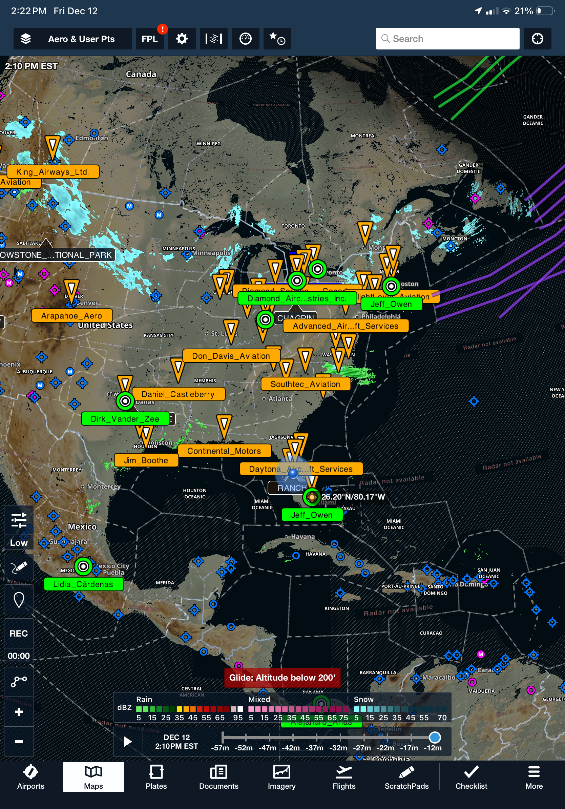

# Diamond Aircraft Authorized Centers Content Pack for ForeFlight

**Download:** [Diamond_Service_Centers_Pack.zip](https://github.com/ingramleedy/ForeFlightContentPacks/blob/main/Diamond_Service_Centers/Diamond_Service_Centers_Pack.zip?raw=true)

This repository provides **source code** to generate KML files and a **ForeFlight content pack** featuring detailed maps, waypoints, and information for Diamond Aircraft's authorized service centers, distributors, and training centers worldwide. These waypoints and overlays help pilots quickly locate official Diamond support locations for maintenance, sales, and training, enhancing situational awareness during flight planning.

The content pack displays centers as custom map layers in ForeFlight, categorized by type (Service Centers, Distributors/Sales Partners, Training Centers), and integrates seamlessly with terrain, hazard advisor, profile view, and sectional charts for better route planning.

   
 

## Content Overview

This content pack includes waypoints for all official Diamond Aircraft locations, sourced directly from Diamond's map data API. It generates separate KML files for each category and a unified ForeFlight content pack for easy import.

**Current version: 2025.12.12**  
**Number of locations: Approximately 192 (varies based on Diamond's updates)**

Locations are grouped into categories:
- **Sales / Distributors** (Green target icons)
- **Service Centers** (Blue airport icons)
- **Training / Flight Schools** (Red school icons)

The Python script automates fetching and parsing data from Diamond's endpoint, ensuring the content stays up-to-date with minimal effort. Generated KML files can be viewed in Google Earth or imported into ForeFlight.

## Inspiration and Credits

This content pack is inspired by and builds upon community efforts to make Diamond Aircraft location data more accessible:

- **[Diamond Aircraft](https://www.diamondaircraft.com/en/service-and-support/service-center-locations/)** – Primary source for all authorized center data, fetched via map API. All location information is credited to Diamond Aircraft Industries.
- **[Diamond Aviators Forum Thread](https://www.diamondaviators.net/forum/viewtopic.php?p=103010&hilit=kml#p103010)** – Special thanks to Marlon for the original exhaustive work in compiling and sharing KML data for Diamond centers. This repository automates Marlon's foundational efforts to keep the data current and converts it into a distributable ForeFlight content pack.
- **[Premier Aircraft Sales (Fort Lauderdale)](https://www.premieraircraftsales.com)** – Grateful acknowledgment for their assistance with instruction, purchasing, and maintenance of my Diamond DA40NG.
- **[MyFlight (Patrick Abel)](https://flymyflight.com)** – Thanks to Patrick Abel for expert guidance on Diamond aircraft ownership, training, and upkeep.

This automation script was developed to simplify updates and distribution, ensuring pilots have the latest information without manual recreation.

## Included Locations

The pack includes worldwide Diamond Aircraft authorized locations, categorized and with detailed info windows. Here's a summary of categories (full list generated dynamically via script):

| Category                  | Icon Style | Example Locations | Notes |
|---------------------------|------------|-------------------|-------|
| Sales / Distributors     | Green Target | Premier Aircraft Sales (USA), Aeropole Denmark (Denmark) | Handles sales and partnerships; often includes demo flights and purchasing support. |
| Service Centers          | Orange Target | Diamond Aircraft Industries (Austria), Various global ASCs | Authorized maintenance and repairs; certified for DA20, DA40, DA42, DA62 models. |
| Training / Flight Schools| Blue Target  | Flight schools affiliated with Diamond | Simulator and flight training centers for type ratings and recurrent training. |

*Fly safe: Always verify center details directly with Diamond or the location before planning visits. Data is fetched from official sources but may change.*

## How to Generate and Use

1. **Download Pre-Generated Files:**
   - Check the [DiamondCenters.zip](https://github.com/ingramleedy/Diamond-Aircraft-Service-Centers/blob/main/DiamondCenters.zip?raw=true) section for ready-to-use ForeFlight content pack.

2. **Import into ForeFlight:**
   - Transfer files to your iPad/iPhone via AirDrop, email, or cloud storage.
   - In ForeFlight: More > Custom Content > Add > Select the pack.
   - Enable the layer in Maps > Layers.

## Importing the Content Pack into ForeFlight

Detailed instructions: [ForeFlight Content Packs Support](https://www.foreflight.com/support/content-packs/).

1. Download the ZIP using the link at the top of this README.
2. On iOS/iPadOS: open in Safari → Downloads → Share → **ForeFlight**.
3. ForeFlight will unpack and install the pack.
4. Restart ForeFlight if layers don't appear immediately.
5. In ForeFlight: **More → Content Packs**, toggle the pack on. On the **Maps** view, enable the pack's layers from the layer selector.

*Note: Content packs require manual re-download for updates, unless using the Cloud Storage sync described below.*

## Addendum: Syncing Content Packs via Cloud Storage (e.g., OneDrive)

For users who want to easily manage and sync the **Diamond Aircraft Authorized Centers** content pack across multiple devices, you can integrate a cloud storage service like Microsoft OneDrive with ForeFlight. This setup allows you to host the content pack **.zip** file in a shared folder, where it can automatically sync across your devices via OneDrive. Once integrated, new or updated .zip files placed in the designated folder will appear in ForeFlight's **More > Downloads** section for import. With ForeFlight's Automatic Content Packs Download setting (enabled by default in recent versions), packs can download automatically, and updates (e.g., replacing the .zip with a newer version) can be handled by re-importing the revised file.

**Note:** This feature requires a ForeFlight Pro or higher subscription plan for Cloud Documents integration. Content packs do not auto-update in-place; you must replace the .zip file with an updated version (ideally including a version number in the optional manifest.json for tracking) and re-import it. However, the cloud sync ensures the latest .zip is available on all linked devices.

### Steps to Integrate OneDrive with ForeFlight
1. **Sign in to ForeFlight Web:** Go to plan.foreflight.com and log in with your ForeFlight account (as an administrator if using a multi-pilot account).

2. **Navigate to Documents:** In the sidebar, click on Documents.

3. **Add a Cloud Drive:** In the My Drives section, click Add a Cloud Drive.

4. **Select OneDrive:** From the Drive Provider dropdown menu, choose OneDrive (supports OneDrive Personal, OneDrive for Business, or SharePoint Online).

5. **Configure the Drive:**
   - Enter a Drive Name (e.g., "My OneDrive").
   - Specify the name of an existing folder in your OneDrive root level (e.g., "ForeFlightDocs"). If it doesn't exist, create it first in your OneDrive account via the web or app.
   - Click Add Drive, then sign in with your Microsoft credentials and grant ForeFlight access to the folder.

6. **Verify Integration:** After connecting, the specified OneDrive folder will be linked for hosting documents and content packs. Files added here will sync to ForeFlight.

### Setting Up the "contentpack" Folder for Automatic Sync
- **Create the Folder:** In your linked OneDrive folder (e.g., "/ForeFlightDocs/"), create a subfolder named exactly **contentpack** (case-sensitive). This is the designated location for content pack .zip files.
- **Full path example:** If your linked folder is "ForeFlightDocs", the path would be /ForeFlightDocs/contentpack/.

- **Place the .zip File:** Download the latest DiamondCenters.zip from this repository at  
  **https://github.com/ingramleedy/Diamond-Aircraft-Service-Centers/blob/main/DiamondCenters.zip?raw=true**  
  and upload it to the contentpack folder in OneDrive. The file will automatically sync across all your devices connected to OneDrive.

### Access in ForeFlight
- Open ForeFlight on your iOS/iPadOS device.
- Go to **More > Downloads**.
- The content pack should appear automatically under available downloads (thanks to Cloud Documents integration).
- If Automatic Content Packs Download is enabled (check in ForeFlight Web: Account > Integrations > Cloud Documents), it will download without manual selection.
- Import the pack as described in the main README (it will appear under More > Custom Content > Content Packs and can be enabled as map layers).

### Handling Updates
- When a new version of the content pack is released (e.g., updated locations from Diamond's latest data), download the new .zip from the repository link above and replace the old one in your OneDrive /contentpack/ folder.
- OneDrive will sync the updated file across devices.
- In ForeFlight, the new version will appear in **More > Downloads**; import it to apply the update (older versions may show expiration warnings if dates are set in the manifest).

This setup ensures your Diamond Aircraft Authorized Centers content pack is always accessible and up-to-date across devices without manual transfers. For more details, refer to ForeFlight's OneDrive Integration Support and Content Packs Support. If using Dropbox instead, the process is similar, with the folder at ~/Dropbox/Apps/ForeFlight/contentpack/.

## How to Generate new KML files
1. **Run the Script:**
   - Clone this repository.
   - Install dependencies: `pip install requests beautifulsoup4`.
   - Run `python generate_kml.py` (or similar script name) to fetch data and create KML files.
   - For ForeFlight pack: Use tools like [ForeFlight Content Pack Creator](https://foreflight.com/support/custom-content) to bundle KMLs`.
   - 

## Contributing

Contributions welcome! If you spot outdated data or have enhancements (e.g., better icons, additional filters), submit a pull request. Ensure any changes respect Diamond's data usage terms.

## License

This project is licensed under the MIT License - see the [LICENSE](LICENSE) file for details. All Diamond Aircraft data remains property of Diamond Aircraft Industries.
