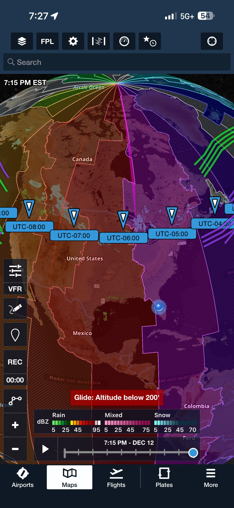

# World Time Zones Content Pack for ForeFlight

**Download:** [Timezones_Pack.zip](https://github.com/ingramleedy/ForeFlightContentPacks/blob/main/Timezones/Timezones_Pack.zip?raw=true)

This repository provides a **ForeFlight content pack** containing a custom KML map layer displaying world time zones with clean UTC offset labels. This overlay helps pilots quickly identify time zone boundaries and offsets during flight planning—whether for international operations or domestic flights crossing zones—improving situational awareness for crew duty times, fuel stops, NOTAM validity, and coordination with ATC or ground services.

The content pack integrates as a user layer in ForeFlight, with individual toggles for each time zone.

**Current version: 2025.12**

**Key feature:**  
When you tap a time zone on the map (or its entry in the Places panel), a rich info balloon appears with detailed information including the standard time zone name, example major cities, DST observance, and military phonetic designation.

## Content Overview

This content pack provides top-level toggleable placemarks for major world time zones, optimized for ForeFlight.

   
 

**Features:**
- Clean on-map labels showing only the UTC offset (e.g., "UTC-05:00")
- Individual toggles in the Places panel for selective display
- Rich HTML info balloons on tap with:
  - UTC offset
  - Common time zone name
  - Example cities
  - DST status (Yes/No/Varies)
  - Military phonetic code (Alpha through Zulu)

This extra detail on click makes the layer valuable for quick reference without cluttering the map.

## Download the Content Pack

Download the ready-to-import ForeFlight content pack here:  
[Timezones.zip](https://github.com/ingramleedy/TimezonesFFContentPack/blob/main/Timezones.zip?raw=true)

## Base Data and Credits

The original base time zone polygons are from the **OpenLayers Project** (open-source mapping library):  
A comprehensive world time zones KML with each zone as a separate polygon feature, including attributes like 'tz-offset' for styling (e.g., opacity based on local time). Polygons are distinct objects, enabling per-zone interaction.  
Source: [timezones.kml](https://github.com/openlayers/openlayers/blob/main/examples/data/kml/timezones.kml) (raw file)

The underlying time zone data is derived from public sources, commonly based on the **IANA Time Zone Database** (tzdata).

This content pack enhances the base KML with:
- Top-level placemarks (no folders) for individual toggling in ForeFlight
- Clean UTC offset labels
- Rich HTML descriptions with time zone name, cities, DST info, and military code

These modifications were scripted to create a ForeFlight-optimized reference layer.

## Included Time Zones

The pack covers major standard time zones, including half-hour offsets where present in the base data. Examples include:

| Offset       | Common Name                  | Example Cities     | DST?    | Military |
|--------------|------------------------------|--------------------|---------|----------|
| UTC-12:00   | International Date Line West | Baker Island      | No      | Yankee  |
| UTC-11:00   | Samoa Standard Time         | Pago Pago         | No      | X-ray   |
| UTC-10:00   | Hawaii-Aleutian Time        | Honolulu          | No      | Whiskey |
| UTC-09:00   | Alaska Standard Time        | Anchorage         | Yes     | Victor  |
| UTC-08:00   | Pacific Standard Time       | Los Angeles       | Yes     | Uniform |
| UTC-07:00   | Mountain Standard Time      | Denver            | Yes     | Tango   |
| UTC-06:00   | Central Standard Time       | Chicago           | Yes     | Sierra  |
| UTC-05:00   | Eastern Standard Time       | New York          | Yes     | Romeo   |
| UTC-04:00   | Atlantic Standard Time      | Halifax           | Varies  | Quebec  |
| UTC-03:00   | Brazil/Argentina Time       | São Paulo         | No      | Papa    |
| UTC+00:00   | UTC / Greenwich Mean Time   | London            | Varies  | Zulu    |
| UTC+01:00   | Central European Time       | Paris             | Yes     | Alpha   |
| UTC+02:00   | Eastern European Time       | Athens            | Varies  | Bravo   |
| UTC+03:00   | Moscow / East Africa Time   | Moscow            | No      | Charlie |
| UTC+08:00   | China Standard Time         | Beijing           | No      | Hotel   |
| UTC+09:00   | Japan / Korea Time          | Tokyo             | No      | India   |
| UTC+10:00   | Australian Eastern Time     | Sydney            | Yes     | Kilo    |

*Half-hour and quarter-hour zones use generic details.*

## Importing the Content Pack into ForeFlight

Detailed instructions: [ForeFlight Content Packs Support](https://www.foreflight.com/support/content-packs/).

1. Download `Timezones.zip` from the link above.
2. In ForeFlight: More > User Content > Add Content Pack.
3. Select the downloaded ZIP file.
4. Enable the layer in Maps > Layers.

Tap any time zone for full details—great for planning and situational awareness on cross-country or international flights!

## Addendum: Syncing Content Packs via Cloud Storage (e.g., OneDrive)

For users who want to easily manage and sync content packs across multiple devices, you can integrate a cloud storage service like Microsoft OneDrive with ForeFlight. This setup allows you to host the content pack .zip file in a shared folder, where it can automatically sync across your devices via OneDrive. Once integrated, new or updated .zip files placed in the designated folder will appear in ForeFlight's **More → Downloads** section for import. With ForeFlight's Automatic Content Packs Download setting (enabled by default in recent versions), packs can download automatically, and updates (e.g., replacing the .zip with a newer version) can be handled by re-importing the revised file.

**Note:** This feature requires a ForeFlight Pro or higher subscription plan for Cloud Documents integration. Content packs do not auto-update in-place; you must replace the .zip file with an updated version (ideally including a version number in the optional manifest.json for tracking) and re-import it. However, the cloud sync ensures the latest .zip is available on all linked devices.

### Steps to Integrate OneDrive with ForeFlight

1. **Sign in to ForeFlight Web:** Go to [plan.foreflight.com](https://plan.foreflight.com) and log in with your ForeFlight account (as an administrator if using a multi-pilot account).
2. **Navigate to Documents:** In the sidebar, click on **Documents**.
3. **Add a Cloud Drive:** In the **My Drives** section, click **Add a Cloud Drive**.
4. **Select OneDrive:** From the **Drive Provider** dropdown menu, choose **OneDrive** (supports OneDrive Personal, OneDrive for Business, or SharePoint Online).
5. **Configure the Drive:**
   - Enter a **Drive Name** (e.g., "My OneDrive").
   - Specify the name of an **existing folder** in your OneDrive root level (e.g., "ForeFlightDocs"). If it doesn't exist, create it first in your OneDrive account via the web or app.
6. **Connect and Authorize:** Click **Add Drive**, then sign in with your Microsoft credentials and grant ForeFlight access to the folder.
7. **Verify Integration:** After connecting, the specified OneDrive folder will be linked for hosting documents and content packs. Files added here will sync to ForeFlight.

### Setting Up the "contentpack" Folder for Automatic Sync

1. **Create the Folder:** In your linked OneDrive folder (e.g., "/ForeFlightDocs/"), create a subfolder named exactly **contentpack** (case-sensitive). This is the designated location for content pack .zip files.
   - Full path example: If your linked folder is "ForeFlightDocs", the path would be `/ForeFlightDocs/contentpack/`.
2. **Place the .zip File:** Download the latest content pack .zip from this repository and upload it to the `contentpack` folder in OneDrive. The file will automatically sync across all your devices connected to OneDrive.
3. **Access in ForeFlight:**
   - Open ForeFlight on your iOS/iPadOS device.
   - Go to **More → Downloads**.
   - The content pack should appear automatically under available downloads (thanks to Cloud Documents integration).
   - If Automatic Content Packs Download is enabled (check in ForeFlight Web: Account → Integrations → Cloud Documents), it will download without manual selection.
   - Import the pack as described in the "Importing the Content Pack into ForeFlight" section above.
4. **Handling Updates:**
   - When a new version of the content pack is released, download the new .zip and replace the old one in your OneDrive `/contentpack/` folder.
   - OneDrive will sync the updated file across devices.
   - In ForeFlight, the new version will appear in More → Downloads; import it to apply the update (older versions may show expiration warnings if dates are set in the manifest).

This setup ensures your content pack is always accessible and up-to-date across devices without manual transfers. For more details, refer to ForeFlight's [OneDrive Integration Support](https://support.foreflight.com/hc/en-us/articles/14443946235671-How-can-OneDrive-be-integrated-with-ForeFlight) and [Content Packs Support](https://foreflight.com/support/content-packs/). If using Dropbox instead, the process is similar, with the folder at `~/Dropbox/Apps/ForeFlight/contentpack/`.
